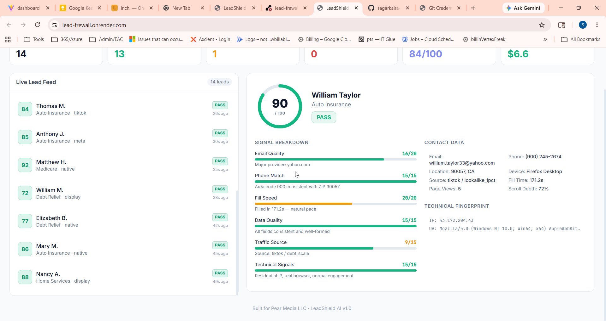

# LeadShield AI

**Real-time AI-powered lead quality firewall for performance marketing agencies.**

Built specifically for [Pear Media LLC](https://www.pearmediallc.com/) to eliminate junk leads before they hit the sales pipeline.

[Live Demo](https://lead-firewall.onrender.com)



---

## The Problem

Pear Media runs **$50M+ in annual ad spend** across Meta, Google, TikTok, and display networks, generating leads for auto insurance, Medicare, home services, and debt relief verticals.

The industry-wide problem: **20-30% of performance marketing leads are junk.**

### How junk leads cost real money

```
                    THE FEEDBACK LOOP OF DOOM

    Meta/Google AI optimizes for "conversions" (form fills)
                          |
                          v
    Finds the cheapest way to get form fills
                          |
                          v
    Floods pipeline with low-intent users, bots, and scrapers
                          |
                          v
    Ad platform sees "conversions" --> thinks it's winning
                          |
                          v
    Buys MORE of the same junk traffic
                          |
                          v
    CPA rises, close rates drop, sales team burns out
```

**At Pear Media's scale:**

| Metric | Value |
|---|---|
| Annual ad spend | $50M+ |
| Avg. cost per lead (blended) | ~$30 |
| Est. junk lead rate | 20-30% |
| **Annual waste on junk leads** | **$10M - $15M** |

Beyond direct cost, junk leads poison the feedback loop — Meta and Google optimize toward the wrong audience profile, compounding the problem over time.

---

## The Solution

LeadShield is a **real-time scoring firewall** that sits between lead capture and CRM delivery. Every lead is analyzed across 6 signal dimensions and scored 0-100 before it touches the sales pipeline.

### Where LeadShield fits in Pear Media's pipeline

**Current flow (no protection):**

```
Ad Campaign ──> Landing Page ──> LeadByte ──> Salesforce / HubSpot ──> Sales Team
                                                                          |
                                                              Calls junk leads
                                                              Wastes time + money
```

**With LeadShield:**

```
Ad Campaign ──> Landing Page ──> LeadByte ──> LeadShield ──> Salesforce / HubSpot
                                                  |
                                                  |──> PASS (70-100): Clean lead → CRM
                                                  |──> REVIEW (40-69): Flagged for manual check
                                                  |──> REJECT (0-39): Blocked. Never reaches sales.
                                                  |
                                                  └──> Feedback to ad platform:
                                                       Only PASS leads count as conversions
                                                       → Fixes the feedback loop
```

**The critical difference:** By feeding only verified leads back to Meta/Google as conversion events, the ad algorithms learn to find *real* prospects instead of optimizing for junk.

---

## How Scoring Works

Every lead is evaluated in **milliseconds** across 6 independent signals:

### 1. Email Quality (0-20 pts)

| Signal | Score | Example |
|---|---|---|
| Corporate email | 20/20 | john@statefarm.com |
| Major provider | 16/20 | john@gmail.com |
| Unknown domain | 10/20 | john@randomsite.net |
| **Disposable email** | **0/20** | **john@mailinator.com** |

Catches throwaway emails from services like Mailinator, TempMail, Guerrilla Mail, YopMail, and 10+ others.

### 2. Phone Match (0-15 pts)

Cross-references the phone area code against the submitted ZIP code region. A California ZIP with a New York area code is a warning sign.

### 3. Fill Speed (0-20 pts)

| Time to fill | Score | Interpretation |
|---|---|---|
| < 3 seconds | 0/20 | Bot or auto-fill script |
| 3-8 seconds | 5/20 | Suspiciously fast |
| 8-15 seconds | 12/20 | Fast but possible |
| **15+ seconds** | **20/20** | **Natural human pace** |

A real person reading and filling an insurance quote form takes 30-180 seconds. Anything under 3 seconds is almost certainly automated.

### 4. Data Consistency (0-15 pts)

- Detects gibberish names ("asdfjkl", "test", "xxxx")
- Validates that email contains name elements
- Checks for field-level consistency

### 5. Traffic Source (0-15 pts)

Scores based on historical quality by platform. Google Search intent leads score higher than display network. Adjustable per vertical.

### 6. Technical Signals (0-15 pts)

- **IP classification:** Residential vs. data center (AWS, GCP, Azure IPs = likely bot)
- **User agent:** Detects bot signatures (python-requests, curl, Scrapy)
- **Engagement depth:** Scroll depth < 15% + single page view = red flag

### Verdict

| Score | Verdict | Action |
|---|---|---|
| 70-100 | **PASS** | Delivered to CRM immediately |
| 40-69 | **REVIEW** | Queued for manual review |
| 0-39 | **REJECT** | Blocked — never reaches sales |

### AI Analysis Layer

Each lead also receives a **Gemini AI assessment** — a plain-English explanation of why the lead scored the way it did. Useful for:

- Training new media buyers on what "quality" looks like
- Auditing edge cases in the REVIEW bucket
- Building institutional knowledge about fraud patterns

### Pattern Detection

LeadShield doesn't just score individual leads — it detects **coordinated fraud patterns** in real time:

- **IP clustering:** 3+ leads from the same IP in 30 seconds
- **Domain clustering:** Unusual volume from a single email domain
- **Rapid fire:** 5+ submissions in 10 seconds
- **Geo mismatch:** Systematic phone/ZIP inconsistencies

---

## ROI Projection

Conservative estimate based on Pear Media's publicly known vertical CPLs:

| Vertical | CPL | Monthly leads (est.) | Junk rate | Monthly savings |
|---|---|---|---|---|
| Auto Insurance | $28 | 50,000 | 20% | $280,000 |
| Medicare | $35 | 30,000 | 25% | $262,500 |
| Home Services | $22 | 40,000 | 20% | $176,000 |
| Debt Relief | $40 | 20,000 | 25% | $200,000 |
| **Total** | | **140,000** | | **$918,500/mo** |

**Annual projected savings: ~$11M**

This doesn't account for the secondary benefit: fixing the ad algorithm feedback loop, which compounds savings over time as the platforms learn to target real prospects.

---

## Start Using It Today

### Step 1: Connect a webhook (30 minutes)

LeadByte already supports outbound webhooks. Point it at LeadShield's scoring endpoint:

```
POST https://your-leadshield-instance.com/api/score

{
  "firstName": "William",
  "lastName": "Taylor",
  "email": "william.taylor33@yahoo.com",
  "phone": "(900) 245-2674",
  "zip": "90057",
  "vertical": "auto_insurance",
  "source": "tiktok",
  "campaign": "auto_q2_broad",
  "timeToFillMs": 171200,
  "device": "Firefox Desktop",
  "ip": "43.172.204.43",
  "userAgent": "Mozilla/5.0 ..."
}
```

**Response:**

```json
{
  "score": 90,
  "verdict": "PASS",
  "signals": [...],
  "aiReasoning": "Strong lead. Valid Yahoo email, phone area code matches CA ZIP, natural 171s fill time, residential IP with real browser engagement.",
  "estimatedValue": 0
}
```

### Step 2: Route based on verdict (1 hour)

In LeadByte, add conditional routing:

- **PASS** → Send to client CRM (Salesforce/HubSpot) as normal
- **REVIEW** → Route to internal review queue
- **REJECT** → Log and discard — don't send to client, don't count as conversion

### Step 3: Close the feedback loop (1 hour)

Update your Meta CAPI and Google Offline Conversions to only report **PASS** leads as conversion events. This is the most impactful change — it retrains the ad algorithms to find people who look like your real customers, not your bots.

### Step 4: Tune and monitor (ongoing)

The dashboard shows live scoring, quality distribution, and pattern alerts. Over the first week, review the REVIEW bucket to calibrate thresholds for each vertical.

**Total integration time: 1-2 days for a production v1.**

---

## Tech Stack

| Layer | Technology |
|---|---|
| Backend | Node.js, Express 5, TypeScript |
| Frontend | React 19, Tailwind CSS |
| Real-time | Socket.io (WebSocket) |
| AI Scoring | Google Gemini Flash |
| Hosting | Render (scalable to any cloud) |

Aligns with Pear Media's existing internal stack (Node.js, React, Next.js).

---

## What's Next

**Week 1-2:** Production integration with LeadByte webhook + real lead data

**Week 3-4:** Calibrate scoring weights using historical conversion data (which leads actually closed?)

**Month 2:** 
- Offline conversion feedback — close the loop with Salesforce/HubSpot disposition data
- Per-vertical scoring models (insurance fraud looks different from home services fraud)

**Month 3:**
- Predictive lead valuation — estimate close probability, not just fraud risk
- Creative-level attribution — which ad creatives produce the highest quality leads?

---

*Built by [Sagar Kalra](mailto:officialsagarkalra@gmail.com) for Pear Media LLC.*
